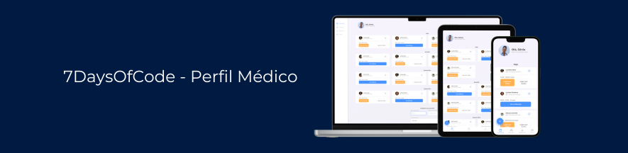

# Projeto Clínica Média - 7DaysOfCode

Este projeto foi realizado durante outro 7 days of code de HTML e CSS da Alura que participei. Diferente do anterior, o objetivo dele foi praticar responsividade a partir do mobile-first. 

## Ferramentas utilizadas:

* HTML

* CSS

* Flex-box

* CSS Grid

* Mobile-First

## Feito por:

### Andre Maia

### Linkedin: https://www.linkedin.com/in/andre-maia-cunha/